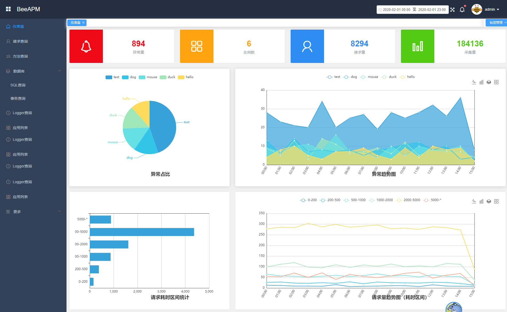
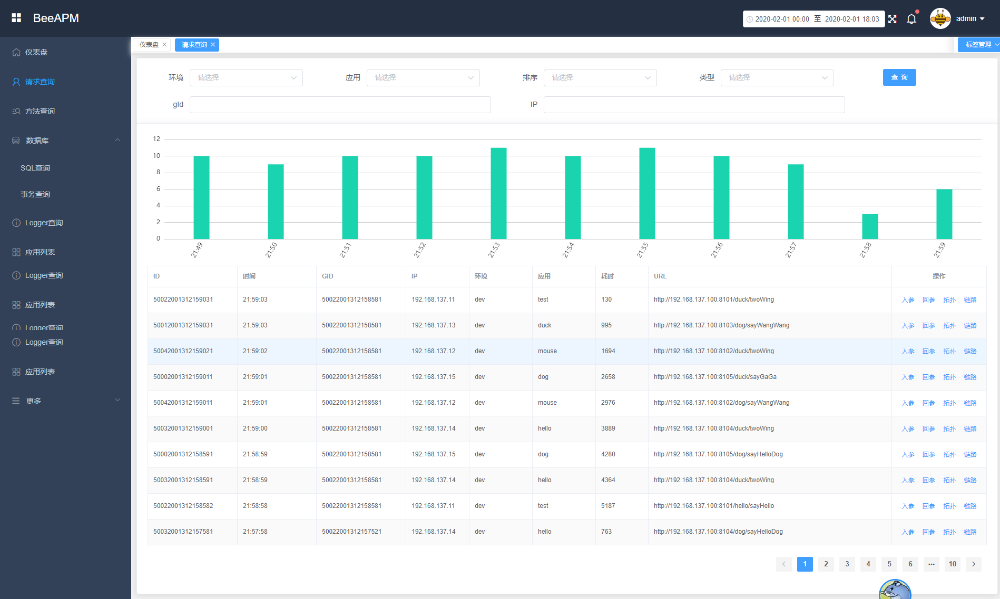
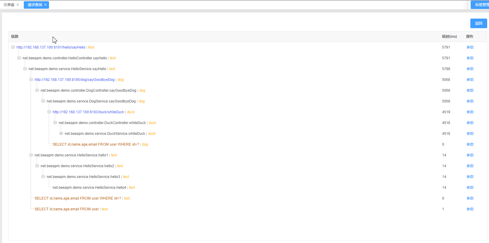
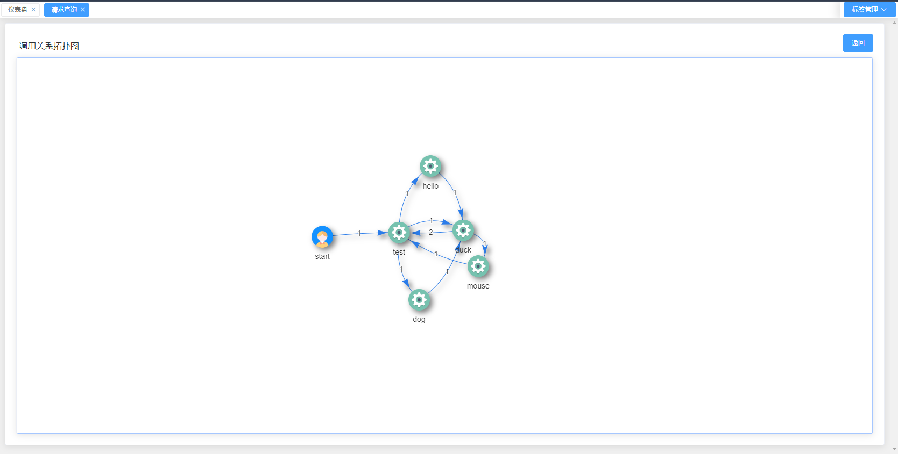
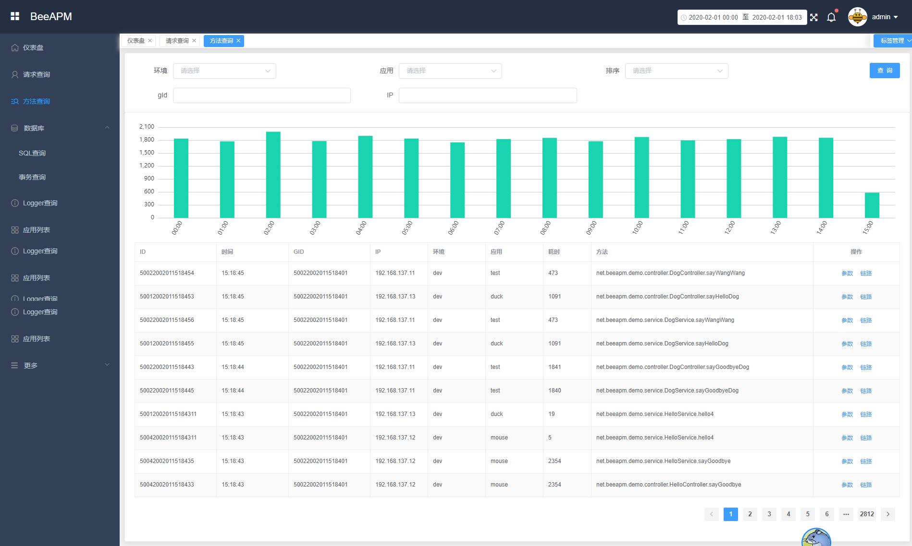
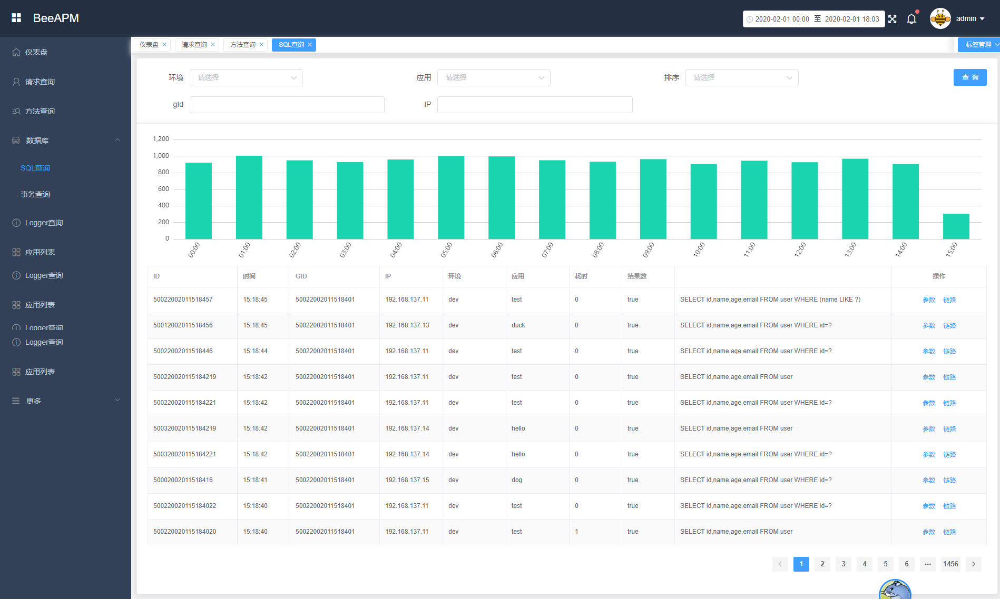
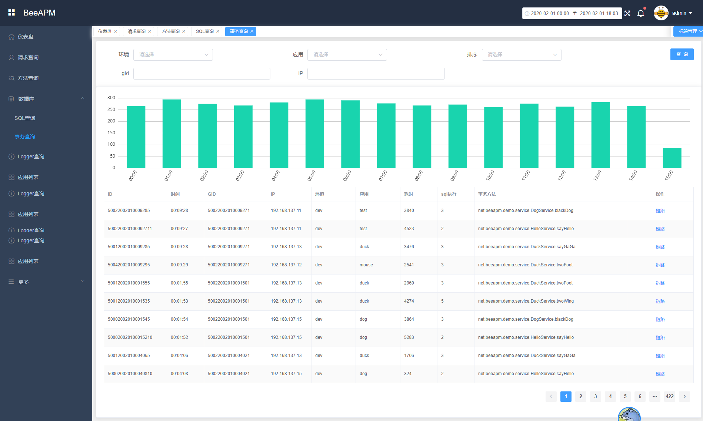
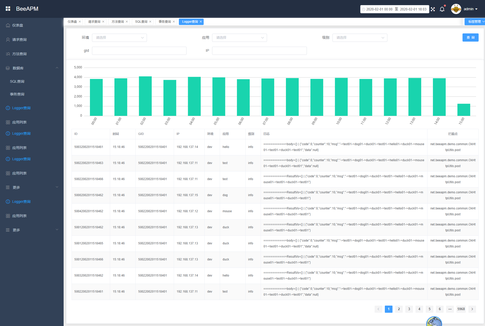
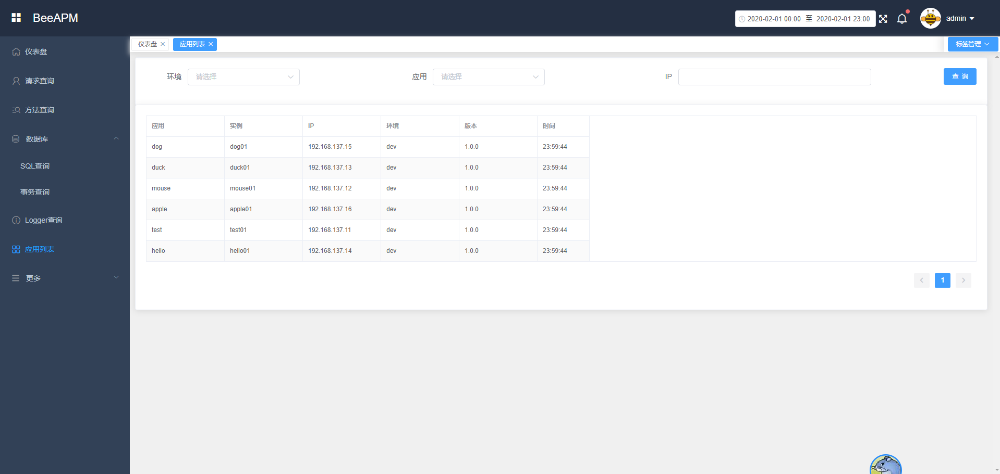

# BeeAPM
BeeAPM是一个分布式跟踪和应用性能监控系统。
该系统应用JavaAgent技术，使用[bytebuddy](https://github.com/raphw/byte-buddy)（基于ASM的框架）进行字节码植入，从而对java应用程序进行相关数据采集和性能监控，
对应用无侵入。
## 源码
github：https://github.com/hao117/bee-apm

gitee ：https://gitee.com/beetle082/bee-apm

## 联系
```
QQ群: 961882872
EMAIL: beetle082@163.com
微信：shui117 （请备注BeeAPM，拉进微信群）
```

## 部署
- [agent部署](docs/cn/agent-deploy.md)
- [server部署](docs/cn/server-deploy.md)
- [UI部署](docs/cn/ui-deploy.md)

## 介绍
### 采集端（agent）
采集数据发送到`APM Server`端或者消息中间件或存储器等
#### 1、采集功能
所有的采集功能均有单独开关配置
- 分布式调用链（方法调用链路、远程调用追踪）
- 采样控制
- 方法采集
    - 方法调用链路
    - 参数采集
    - 执行耗时
    - 方法信息
    - 耗时阀值控制（超过一定时间阀值的不采集）
    - 采集点配置
    - 返回值采集 （考虑）
- http追踪
    - 支持httpclient3
    - 支持httpclient4
    - 支持okhttp3
    - jdk-http（待开发）
- 支持servlet采集
    - 主流容器支持（tomcat，weblogic，jetty等）
    - 链路支持
    - 基本请求信息
    - 耗时采集
    - 耗时阀值控制
    - request body采集
    - request parameter
    - request header采集
    - response body采集
    - session采集（待开发）
- jdbc采集（jdbc规范）
    - 采集sql语句
    - 采集sql参数
    - 采集执行时间
    - 耗时阀值控制
    - 采集结果集大小
- logger采集
    - 支持log4j
    - 支持log4j2
    - 支持logback
    - 采集点可配置
    - error以上级别是否采样控制
- spring事务
    - 事务持有时间
    - 执行sql次数
    - 事务耗时阀值控制
- 异常信息采集,支持采集点黑白名单配置
- 支持携程apollo（仅支持启动时拉取配置）
- 半自动API（待开发）
- gc、堆栈、内存、线程等采集
- 统计采集（待开发）

#### 2、传输能力
- 支持输出到控制台
- 支持输出到远程http服务器
    - 支持okhttp
- 支持输出到kafka，支持kafka 1.x
- 支持输出到RocketMq
- 支持输出到pulsar（待开发）
- 支持输出到ElasticSearcch（待开发）

### APM Server端
数据收集和存储。从采集端接受数据或者从消息中间件中拉取数据，并进行存储
#### 1、数据收集
- http接受，使用servlet接收采集端发送过来的数据
- 从kafka拉取数据
- 从pulsar拉取数据（待开发）

#### 2、数据存储
- ElasticSearch
- mysql（待开发）
- oracle（待开发）
- h2（待开发）

### APM UI端
开发中。。。
支持调用链展示，采集数据查询，报表等











